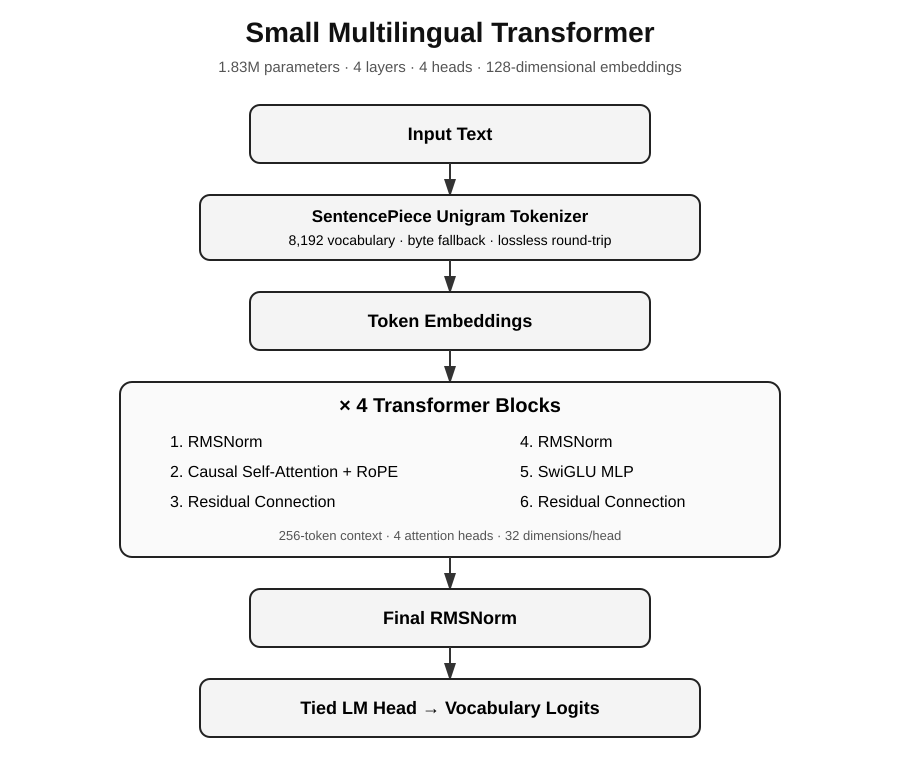

# Transformer-Based Small Language Model for Multilingual Text

A **1.83M-parameter decoder-only Transformer built from scratch in PyTorch** for multilingual language modeling under a strict compute budget.

The project asks: **how much language-modeling efficiency can a tiny model obtain from careful architecture, tokenization, and optimization choices?**

> **Best recorded result:** **1.7067 bits/byte (bpb)** on the development evaluation, versus **2.3718 bpb** for the byte-tokenizer baseline — a **28.0% relative improvement**.

## Why this project

This is not intended to compete with production LLMs. The model was deliberately constrained to approximately **2M parameters, 2,000 training steps, and CPU training** so that architecture, tokenization, and optimization choices could be evaluated under controlled conditions.

## Results at a glance

| Metric / experiment | Result |
|---|---:|
| Parameters | **1,827,968** |
| Context length | **256 tokens** |
| Vocabulary | **8,192** |
| Training steps | **2,000** |
| Training device | **CPU** |
| Byte-tokenizer baseline | 2.3718 bpb |
| Final Unigram model | **1.7067 bpb** |
| Muon + AdamW ablation | 1.7210 bpb |
| Relative improvement vs byte baseline | **28.0%** |

**Lower bpb is better.** The final checkpoint uses plain Adam because it produced the best recorded result under the fixed experimental setup.

## Architecture



| Component | Configuration |
|---|---|
| Model | Decoder-only GPT-style Transformer |
| Layers | 4 |
| Attention heads | 4 |
| Embedding dimension | 128 |
| Positional encoding | RoPE |
| Normalization | RMSNorm |
| Feed-forward network | SwiGLU |
| Weight tying | Token embedding ↔ LM head |
| Attention | Causal scaled dot-product attention |
| Tokenizer | SentencePiece Unigram |
| Vocabulary | 8,192 + byte fallback |

The Transformer is implemented directly with PyTorch modules rather than relying on a pretrained Transformer stack.

## Tokenization

The tokenizer uses **SentencePiece Unigram with byte fallback**. This provides compact subword representations while retaining a lossless path for arbitrary UTF-8 text.

The evaluator verifies:

```text
text -> encode -> decode == original text
```

If the round trip fails, evaluation stops rather than reporting a misleading score.

A raw byte tokenizer is also available as a fallback when no trained SentencePiece model is present.

## Training

The training loop supports:

1. **Adam** over all parameters
2. **Muon + AdamW** split between Transformer matrices and remaining parameters

Training also includes:

- linear learning-rate warmup
- cosine learning-rate decay
- global gradient clipping
- configurable random seed
- configurable model dimensions
- explicit 2M-parameter guard
- checkpoint metadata containing model configuration and tokenizer identity
- saved training loss curve

Example:

```bash
python train.py --data ../data/train_corpus.txt --steps 2000 --batch 8 --optimizer adam_all --out ckpt.pt
```

## Evaluation methodology

The primary metric is **bits per byte (bpb)** rather than bits per token. This makes the headline comparison less dependent on tokenizer sequence length.

Evaluation uses a sliding context window and reports:

- bpb
- parameter count
- training steps
- input token count
- scored token count

Run the standard evaluation:

```bash
python evaluate.py --checkpoint ckpt.pt --text_file data/sample_eval.txt
```

For language-specific evaluation, provide separate UTF-8 evaluation files:

```bash
python evaluate_languages.py \
  --english data/sample_eval_english.txt \
  --hindi data/sample_eval_hindi.txt
```

The utility reuses the same bpb implementation and emits machine-readable JSON, making it suitable for transparent per-language reporting.

### Reported development result

| Experiment | Dev bpb | Interpretation |
|---|---:|---|
| Byte-tokenizer baseline | 2.3718 | Reference system |
| Final Unigram Transformer | **1.7067** | Best recorded configuration |
| Muon + AdamW | 1.7210 | Optimizer ablation |

The final evaluation scored **37,272 tokens** after 2,000 training steps. The optimizer comparison is limited to the tested configurations and should not be interpreted as a universal ranking of Adam versus Muon.

## Interactive demo

The repository includes an optional Gradio interface for trying the released checkpoint with English or Hindi prompts.

Install the demo dependency:

```bash
pip install -r requirements.txt
pip install -r requirements-demo.txt
```

Launch:

```bash
python app.py
```

The demo exposes temperature, top-k, maximum generation length, and seed controls. It is deliberately labeled as an **experimental small language model**, not a chatbot or production inference system.

## Generation examples

Generation is qualitative only; **bpb remains the primary quantitative metric**. The examples below are intentionally raw model output rather than manually polished text.

### English — recorded generation

```text
Prompt: The state
Temperature: 0.7
Top-k: 40
Seed: 42

Generated:
The state. The war rate of the United States was shosed by the South Atlantic Ocean, and the U.S. U.S. Constitution in the Atlantic Ocean, and the western North Sea.
```

### Hindi / multilingual inference

The released checkpoint accepts UTF-8 Hindi prompts through the same tokenizer and Transformer pipeline. To reproduce a Hindi generation locally:

```bash
python generate.py \
  --checkpoint ckpt.pt \
  --prompt "भारत एक" \
  --temperature 0.7 \
  --top_k 40 \
  --max_new_tokens 50 \
  --seed 42
```

The interactive `app.py` demo provides the same controls without requiring a terminal command.

## Reproducibility

The released checkpoint stores the model configuration, training-step count, random seed, tokenizer filename, and training loss curve.

For deterministic sampling, fix the seed:

```bash
python generate.py --checkpoint ckpt.pt --prompt "भारत एक" --temperature 0.7 --top_k 40 --max_new_tokens 50 --seed 42
```

Run the tests:

```bash
python -m unittest discover -s tests -v
```

The test suite covers model forward/loss behavior, the parameter budget, context-length enforcement, and lossless UTF-8 byte-tokenizer round trips.

For a clean environment:

```bash
python -m venv .venv
# Windows: .venv\\Scripts\\activate
# Linux/macOS: source .venv/bin/activate
pip install -r requirements.txt
```

## Experiments

The full experimental progression is documented in [`RUNLOG.md`](RUNLOG.md).

| Change | Evidence / role |
|---|---|
| Byte tokenizer → Unigram | 2.3718 → 1.9326 bpb reference improvement |
| RoPE + RMSNorm + SwiGLU + scaled residual init | Higher-capacity architecture within 2M parameters |
| Muon + AdamW | 1.7210 bpb ablation |
| Plain Adam | **1.7067 bpb final checkpoint** |

The Adam-only run was slightly better than the tested Muon + AdamW configuration and had essentially the same wall-clock time. The run log explicitly records that this is a limited optimizer comparison rather than a tuned optimizer sweep.

### Design rationale

- **RoPE:** positional information without learned position embeddings.
- **RMSNorm:** lightweight normalization in pre-norm Transformer blocks.
- **SwiGLU:** stronger feed-forward expressiveness within the parameter budget.
- **Weight tying:** reduces duplicated embedding/output parameters.
- **Unigram + byte fallback:** improves tokenization efficiency while preserving UTF-8 round trips.
- **Scaled residual initialization:** controls residual-stream variance in the shallow Transformer.

## Limitations

This project intentionally operates far below the scale of modern language models.

- 1.83M parameters severely limits generation quality.
- 2,000 training steps and CPU training provide a small compute budget.
- bpb measures language-modeling efficiency, not instruction following, reasoning, factuality, or downstream task performance.
- The optimizer experiment is an ablation, not a complete hyperparameter sweep.
- The reported result is a development-set result under the project's fixed experimental protocol.

These limitations are part of the experiment rather than hidden weaknesses in the reporting.

## Repository structure

```text
├── model.py                 # Transformer architecture
├── tokenizer.py             # SentencePiece / byte tokenizer
├── train.py                 # Training loop
├── evaluate.py              # Standard bpb evaluator
├── evaluate_languages.py    # Per-language bpb evaluator
├── generate.py              # Deterministic CLI generation
├── app.py                   # Optional Gradio demo
├── muon.py                  # Muon optimizer
├── ckpt.pt                  # Released checkpoint
├── tok_v8192.model          # SentencePiece model
├── tok_v8192.vocab          # SentencePiece vocabulary
├── docs/                    # Architecture documentation
├── data/                    # Evaluation / smoke-test data
├── tests/                   # Model and tokenizer tests
├── NOTES.md                 # Design decisions
├── RUNLOG.md                # Experiment log
├── SUMMARY.html             # Project summary
├── requirements.txt         # Core dependencies
└── requirements-demo.txt    # Optional demo dependency
```

## Tech stack

**Python · PyTorch · SentencePiece · Transformer · RoPE · RMSNorm · SwiGLU · Muon · AdamW · bpb evaluation · Gradio**

## Author

**Atul1127**

Built from scratch as an experiment in efficient multilingual language modeling.
